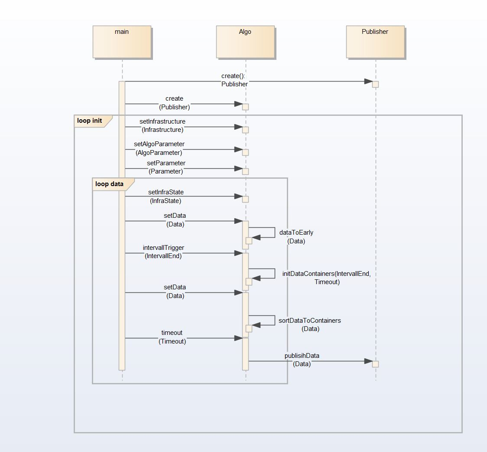

# Zeitsynchronisation

### Lastenheft:
Im Lastenheft für VMIS2 gibt es folgende TAnfs, die im Zusammenhang mit der Zeitsychronisation stehen: VMIS2-S1ANF-291,  VMIS2-S1ANF-350, VMIS2-S1ANF-714,  VMIS2-S1ANF-487,  VMIS2-S3ANF-121.

### VSTS:
User Story: https://vmis-ehe.visualstudio.com/vmis2/_workitems/edit/4501

### Alte Tests:
Altes Projekt C++ inkl.  DerTest Testdateien:  https://gitlab.heuboe.hbintern/VMIS2/control/vmis1-cpp/pspvehsync/tree/master 
Excel-Sheet mit alten Test-Daten zu pspVehSync, die auch in diesen Projekt-Tests verwendet wurden:
[pspVehSync.xls](pspVehSync.xls)

### Ablauf

